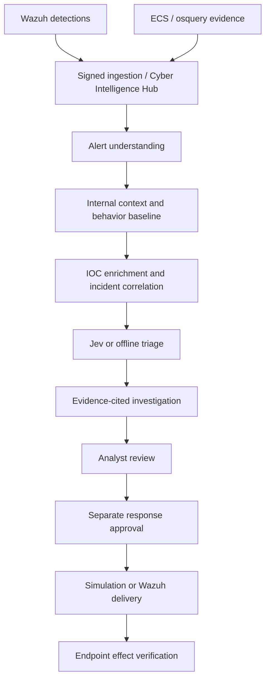

<a id="readme-top"></a>
<div align="center">
  
  <h1>HyperSOC</h1>
  <p>
    An evidence-driven SOC automation lab built around Wazuh,
    a Cyber Intelligence Hub, and human-reviewed AI investigations.
    <br />
    <a href="docs/soc-deployment.md"><strong>Explore the docs »</strong></a>
    <br /><br />
    <a href="demo/full_attack_chain/README.md">View Demo</a>
    &middot;
    <a href="https://github.com/h26v/HyperSOC/issues/new">Report Bug</a>
    &middot;
    <a href="https://github.com/h26v/HyperSOC/issues/new">Request Feature</a>
  </p>
</div>

<details>
  <summary>Table of Contents</summary>
  <ol>
    <li><a href="#about-the-project">About The Project</a>
      <ul><li><a href="#built-with">Built With</a></li></ul>
    </li>
    <li><a href="#getting-started">Getting Started</a>
      <ul>
        <li><a href="#prerequisites">Prerequisites</a></li>
        <li><a href="#installation">Installation</a></li>
      </ul>
    </li>
    <li><a href="#usage">Usage</a>
      <ul>
        <li><a href="#provider-configuration">Provider Configuration</a></li>
        <li><a href="#vmware-lab">VMware Lab</a></li>
        <li><a href="#documentation">Documentation</a></li>
      </ul>
    </li>
    <li><a href="#roadmap">Roadmap</a></li>
    <li><a href="#contributing">Contributing</a></li>
    <li><a href="#license">License</a></li>
    <li><a href="#contact">Contact</a></li>
    <li><a href="#acknowledgments">Acknowledgments</a></li>
  </ol>
</details>

## About The Project

**HyperSOC / AI SOC Lab** helps SOC analysts and security engineers turn security
telemetry into reviewable incident investigations. Wazuh supplies telemetry and
detections; HyperSOC adds normalized evidence, internal context, IOC enrichment,
correlation, AI triage, and response approval.

The Cyber Intelligence Hub stores assets, identities, posture, behavior,
relationships, and historical analyst decisions with source references. A durable
worker moves each detection through checkpoints and retries to analyst review.



### Key Features

- **Incident correlation:** group related alerts by host, source IP, and time;
  score authentication, PowerShell, persistence, and malware/hash activity.
- **Shared evidence model:** normalize Wazuh alerts and accept canonical, ECS,
  and osquery evidence through signed ingestion.
- **Internal context:** query inventory, posture, behavior, entity relationships,
  and previous analyst decisions from the Hub.
- **Learned behavior:** train categorical baselines from prior telemetry and
  expose anomalies, technique transitions, and access-path hypotheses with provenance.
- **AI investigations:** use offline analysis or opt into Jev triage and
  OpenRouter planning, alert summaries, and evidence-cited findings.
- **Local knowledge:** retrieve MITRE ATT&CK notes, Wazuh references, Sigma
  explanations, and SOC playbooks from Markdown.
- **Analyst console:** authenticated viewer, analyst, and admin roles; incident
  review, Hub exploration, workflow checkpoints, response approval, and audit history.
- **Controlled response:** approve or reject `BLOCK_IP` actions; distinguish
  simulation, Manager acceptance, and verified endpoint containment.

### Scope and Defaults

Providers default to offline mode. External threat intelligence, Jev/OpenRouter
processing, and real Wazuh Active Response are opt-in. Authentication and role
checks are enabled by default.

An offline response can record `SUCCESS` with `containment_verified=false` while
leaving the incident lifecycle unchanged. Manager acceptance establishes delivery.
An incident becomes `CONTAINED` only after post-approval block evidence is present
for every requested agent. Investigation review and response approval are separate
operations.

This is a SOC lab MVP. Multi-tenancy, enterprise SSO, a full SOAR platform, malware
sandboxing, and response actions beyond `BLOCK_IP` are outside the current scope.
See [MVP scope](docs/mvp-scope.md) and [deployment acceptance](docs/soc-deployment.md).

### Built With

[![Python][python-shield]](https://www.python.org/)
[![FastAPI][fastapi-shield]](https://fastapi.tiangolo.com/)
[![PostgreSQL][postgres-shield]](https://www.postgresql.org/)
[![Docker][docker-shield]](https://www.docker.com/)

| Component | Technology |
| --- | --- |
| API and durable worker | Python, FastAPI, Pydantic |
| Persistence and migrations | PostgreSQL, async SQLAlchemy, Alembic |
| Analyst console | HTML, CSS, JavaScript; served by the backend |
| Telemetry and response integration | Wazuh; native ECS and osquery adapters |
| Optional AI providers | TypeSafe Jev SDK, OpenRouter |
| Deployment and verification | Docker Compose, pytest, isolated benchmark scripts |

<p align="right">(<a href="#readme-top">back to top</a>)</p>

## Getting Started

### Prerequisites

- Git, Docker Engine, and Docker Compose v2.
- An available host port `8000`.
- An existing Wazuh Manager for real detections; Compose does not install Wazuh.
- Network access for initial image builds and dependency downloads.

Python and database dependencies run in containers. The shell examples below use
Bash; on PowerShell, use `Copy-Item .env.example .env` instead of `cp`.

### Installation

1. Clone the repository and create your configuration:

   ```bash
   git clone https://github.com/h26v/HyperSOC.git
   cd HyperSOC
   cp .env.example .env
   ```

2. Edit `.env` before startup:

   - Set `APP_SECRET_KEY` to a long random secret. The example placeholder is rejected.
   - Replace `POSTGRES_PASSWORD` and use the same password in `DATABASE_URL`.
   - Keep credentials in your private configuration; `.env` is excluded from Git.
   - Leave provider modes offline for the initial local setup.

3. Build and start the backend and worker with their database and migration dependencies:

   ```bash
   docker compose up -d --build backend worker
   ```

   The migration service runs before the applications start. Redis is reserved
   for future use and is not needed by the current PostgreSQL-backed worker.

4. Verify readiness and create an administrator account:

   ```bash
   curl -fsS http://localhost:8000/health
   curl -fsS http://localhost:8000/ready
   docker compose exec backend python -m app.workers.create_user soc-admin admin
   ```

   The account command prompts for a password. Open
   [the console](http://localhost:8000) and sign in. API documentation is available
   at [localhost:8000/docs](http://localhost:8000/docs).

5. Connect Wazuh using the [integration guide](docs/wazuh-integration.md).

   The adapter signs alerts with the configured shared secret. Use an ingestion
   URL reachable **from the Manager**. The backend binds to `127.0.0.1:8000` by
   default; an external Manager needs a reachable, restricted ingress path or a
   shared Docker network. PostgreSQL has no published host port.

For development with live backend source mounts:

```bash
docker compose -f docker-compose.yml -f compose.dev.yml up -d --build backend worker
```

<p align="right">(<a href="#readme-top">back to top</a>)</p>

## Usage

### Investigate and Review

1. Ingest signed detections from Wazuh. A new alert queues the worker automatically;
   replayed alerts are deduplicated.
2. Inspect alerts and correlated incidents in the console. The automatic pipeline
   also creates a reviewable case for a singleton detection.
3. Open `/investigator` to inspect the tool plan, evidence ledger, findings, and gaps.
4. Confirm or correct the draft conclusion as the authenticated analyst.
5. Request a response action separately and complete its approval and effect-verification flow.

Investigation tools are restricted to linked alerts, cached IOC verdicts, local
knowledge, and Hub context. They cannot execute arbitrary SQL, commands, or external
lookups. Citation IDs must exist in the collected ledger; an analyst still needs
to assess whether each claim is supported.

### API Examples

Obtain a bearer token from `/api/v1/auth/login` and set `SOC_TOKEN` in your shell.
The following requests require an authenticated account with the appropriate role:

```bash
curl -fsS -H "Authorization: Bearer $SOC_TOKEN" \
  'http://localhost:8000/api/v1/alerts?limit=10'

curl -fsS -H "Authorization: Bearer $SOC_TOKEN" \
  'http://localhost:8000/api/v1/workflows?limit=10'

curl -fsS -H "Authorization: Bearer $SOC_TOKEN" \
  'http://localhost:8000/api/v1/dashboard/summary'

curl -fsS -H "Authorization: Bearer $SOC_TOKEN" -X POST \
  'http://localhost:8000/api/v1/incidents/<incident-id>/triage'
```

Replace `<incident-id>` with an ID from the incidents API. Signed ingestion is a
separate authentication contract; an unsigned alert POST is not a valid smoke test.

### Provider Configuration

| Capability | Default | Opt-in configuration |
| --- | --- | --- |
| AI triage | `offline` | `AI_TRIAGE_PROVIDER_MODE=jev`, `TYPESAFE_API_KEY`; optional `TYPESAFE_BASE_URL` and `TYPESAFE_MODEL` |
| Investigation | `offline` | `INVESTIGATOR_PROVIDER_MODE=openrouter`, `INVESTIGATOR_OPENROUTER_API_KEY`, `INVESTIGATOR_MODEL` |
| Alert understanding | `offline` | `ALERT_UNDERSTANDING_PROVIDER_MODE=openrouter`; uses the investigator model and key |
| Threat intelligence | `offline` | Configure external provider mode, enable external lookups, and supply the selected provider credentials |
| Active Response | `offline` | `WAZUH_ACTIVE_RESPONSE_PROVIDER_MODE=wazuh`, Manager API credentials, and explicit agent IDs |

Jev can connect directly to TypeSafe or through OpenRouter. The investigator can
reuse `TYPESAFE_API_KEY` when `TYPESAFE_BASE_URL=https://openrouter.ai/api`.
Choose an investigator model/provider that supports JSON-schema structured output.
External AI calls send sanitized, bounded evidence to the configured service;
review the [AI data boundaries](docs/ai-triage.md) before enabling them.

An investigation makes at most two model requests and four local tool calls.
Optional alert understanding adds a separate model request. Recreate both backend
and worker after changing their provider configuration.

### VMware Lab

The [lab wiring guide](docs/lab-wiring.md) documents the existing deployment,
private configuration, shared-folder behavior, collector, SSH tunnel, and verification
commands. Its verified pipeline runs Wazuh ingestion, live Jev/OpenRouter analysis,
a behavior baseline, and analyst review. Threat Intelligence and Active Response
remain offline in that lab configuration.

### Documentation

| Guide | Coverage |
| --- | --- |
| [SOC deployment](docs/soc-deployment.md) | Accounts, connectors, worker, baseline training, and containment acceptance |
| [Architecture mapping](docs/soc-model-implementation.md) | SOC model requirements, implementation, and verification evidence |
| [Lab wiring](docs/lab-wiring.md) | Existing VMware deployment and operating commands |
| [Wazuh integration](docs/wazuh-integration.md) | Signing, Manager setup, permissions, topology, and troubleshooting |
| [Threat intelligence](docs/threat-intelligence.md) | IOC extraction, provider configuration, and caching |
| [Correlation](docs/correlation.md) | Incident rules and idempotency |
| [AI triage](docs/ai-triage.md) | Typed decisions, provider setup, and data boundaries |
| [Knowledge base](docs/knowledge-base.md) | Markdown indexing, metadata, and retrieval |
| [Prompt-injection controls](docs/prompt-injection-protection.md) | Untrusted evidence and sanitization |
| [Frontend](frontend/README.md) | Console routes and API mapping |
| [MITRE visualization](docs/mitre-visualization.md) | Technique rendering contract |
| [Demo walkthrough](demo/full_attack_chain/README.md) | Telemetry through simulated containment |

<p align="right">(<a href="#readme-top">back to top</a>)</p>

## Roadmap

Implemented in the current MVP:

- [x] Signed ingestion, normalization, IOC enrichment, and incident correlation.
- [x] Cyber Intelligence Hub, native adapters, and internal-context tools.
- [x] Durable automation with checkpoints, leases, and retries.
- [x] Behavior baselines and evidence-cited AI investigations.
- [x] Authenticated console, analyst review, and audited response approval.
- [x] Wazuh lab wiring with live provider and workflow verification.

Possible extensions beyond the current MVP:

- [ ] Additional approved response actions and telemetry/provider adapters.
- [ ] Enterprise SSO and tenant isolation.
- [ ] Broader representative evaluations and production-scale operational validation.

These extensions have no committed delivery schedule. See
[open issues](https://github.com/h26v/HyperSOC/issues) for proposals and known issues,
and [MVP scope](docs/mvp-scope.md) for current boundaries.

<p align="right">(<a href="#readme-top">back to top</a>)</p>

## Contributing

Open an issue with reproduction steps, expected behavior, and sanitized logs.
Discuss larger changes before implementation. Useful contributions include provider
adapters, representative fixtures, correlation and policy tests, and documentation.

1. Fork the repository.
2. Create a branch: `git checkout -b feature/your-change`.
3. Implement the change and run the relevant checks.
4. Commit and push your branch.
5. Open a pull request explaining the resulting behavior and what you verified.

Run containerized tests and the offline pilot from a Bash environment with GNU Make:

```bash
make test
make benchmark-smoke
```

These commands use isolated Compose projects and do not reuse the normal database
volume. See [testing](docs/testing.md), [AI evaluation](docs/ai-evaluation.md),
[SOC workflow benchmarks](docs/soc-workflow-benchmark.md),
[token and cost controls](docs/llm-cost-token-control.md),
[observability](docs/observability.md), and
[security hardening](docs/security-hardening.md).

Keep API keys, credentials, and sensitive production telemetry out of issues,
fixtures, and commits. Scripts in [attacks/](attacks/README.md) provide benign lab
telemetry scaffolding; use them only on authorized lab hosts.

<p align="right">(<a href="#readme-top">back to top</a>)</p>

## License

No project-wide license file is currently included in this checkout. A project
license has not been documented here; the README template's license does not
establish a license for HyperSOC.

<p align="right">(<a href="#readme-top">back to top</a>)</p>

## Contact

Maintainer: [h26v](https://github.com/h26v)

Project: [h26v/HyperSOC](https://github.com/h26v/HyperSOC)

Questions and bug reports: [GitHub Issues](https://github.com/h26v/HyperSOC/issues)

<p align="right">(<a href="#readme-top">back to top</a>)</p>

## Acknowledgments

- [Best-README-Template](https://github.com/othneildrew/Best-README-Template) by
  othneildrew — the structure and navigation used in this README.
- [Wazuh](https://wazuh.com/) — telemetry, detections, and response integration.
- [MITRE ATT&CK](https://attack.mitre.org/) and [Sigma](https://sigmahq.io/) — local
  knowledge and detection references.
- [TypeSafe](https://typesafe.ai/) and [OpenRouter](https://openrouter.ai/) — optional
  AI provider integrations.
- [Shields.io](https://shields.io/) — README badges.

<p align="right">(<a href="#readme-top">back to top</a>)</p>

[stars-shield]: https://img.shields.io/github/stars/h26v/HyperSOC.svg?style=for-the-badge
[stars-url]: https://github.com/h26v/HyperSOC/stargazers
[forks-shield]: https://img.shields.io/github/forks/h26v/HyperSOC.svg?style=for-the-badge
[forks-url]: https://github.com/h26v/HyperSOC/network/members
[issues-shield]: https://img.shields.io/github/issues/h26v/HyperSOC.svg?style=for-the-badge
[issues-url]: https://github.com/h26v/HyperSOC/issues
[python-shield]: https://img.shields.io/badge/Python-3776AB?style=for-the-badge&logo=python&logoColor=white
[fastapi-shield]: https://img.shields.io/badge/FastAPI-009688?style=for-the-badge&logo=fastapi&logoColor=white
[postgres-shield]: https://img.shields.io/badge/PostgreSQL-4169E1?style=for-the-badge&logo=postgresql&logoColor=white
[docker-shield]: https://img.shields.io/badge/Docker-2496ED?style=for-the-badge&logo=docker&logoColor=white
